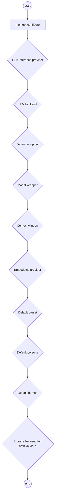
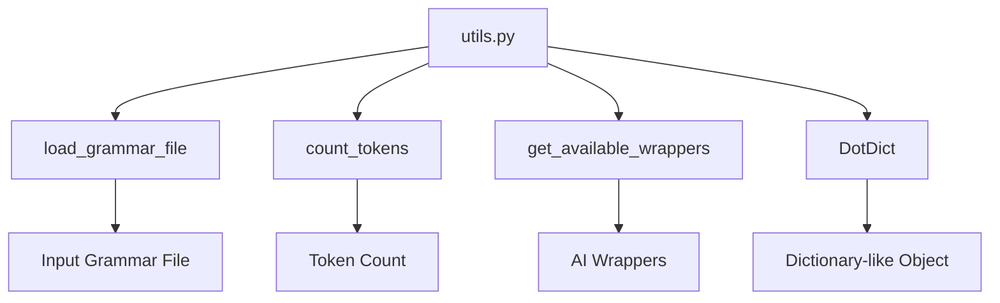
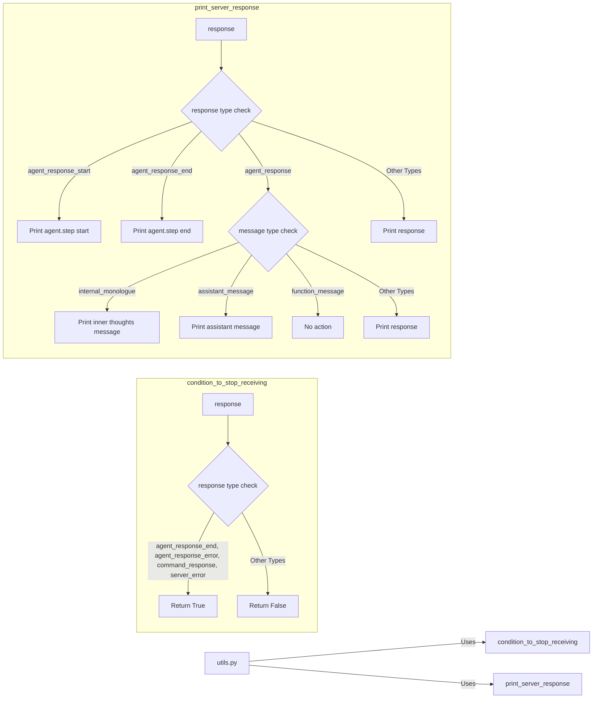
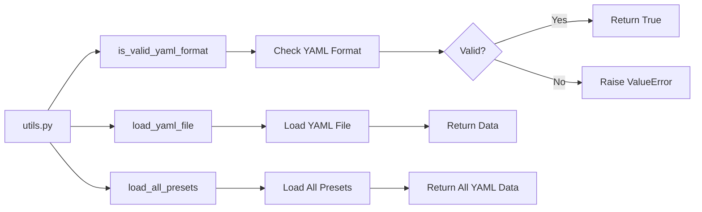

```mermaid
graph TB
subgraph utils.py
    count_tokens["count_tokens()"] --> cosine_similarity["cosine_similarity()"]
    cosine_similarity --> united_diff["united_diff()"]
    united_diff --> get_local_time_military["get_local_time_military()"]
    get_local_time_military --> get_local_time_timezone["get_local_time_timezone()"]
    get_local_time_timezone --> get_local_time["get_local_time()"]
    get_local_time --> parse_json["parse_json()"]
    parse_json --> prepare_archival_index["prepare_archival_index()"]
    prepare_archival_index --> read_in_chunks["read_in_chunks()"]
    read_in_chunks --> read_pdf_in_chunks["read_pdf_in_chunks()"]
    read_pdf_in_chunks --> read_in_rows_csv["read_in_rows_csv()"]
    read_in_rows_csv --> prepare_archival_index_from_files["prepare_archival_index_from_files()"]
    prepare_archival_index_from_files --> total_bytes["total_bytes()"]
    total_bytes --> chunk_file["chunk_file()"]
    chunk_file --> chunk_files["chunk_files()"]
    chunk_files --> chunk_files_for_jsonl["chunk_files_for_jsonl()"]
    chunk_files_for_jsonl --> process_chunk["process_chunk()"]
    process_chunk --> process_concurrently["process_concurrently()"]
    process_concurrently --> prepare_archival_index_from_files_compute_embeddings["prepare_archival_index_from_files_compute_embeddings()"]
    prepare_archival_index_from_files_compute_embeddings --> read_database_as_list["read_database_as_list()"]
    read_database_as_list --> estimate_openai_cost["estimate_openai_cost()"]
    estimate_openai_cost --> list_agent_config_files["list_agent_config_files()"]
    list_agent_config_files --> list_human_files["list_human_files()"]
    list_human_files --> list_persona_files["list_persona_files()"]
    list_persona_files --> get_human_text["get_human_text()"]
    get_human_text --> get_persona_text["get_persona_text()"]
    get_persona_text --> get_human_text["get_human_text()"]
    get_human_text --> get_schema_diff["get_schema_diff()"]
end
```

## Module: utils.py
- **Module Name**: The name of the module is `utils.py`.

- **Primary Objectives**: The purpose of this module is to configure the memGPT local language model (LLM) using the `configure_memgpt_localllm()` function. It also contains a placeholder for future implementation of `configure_memgpt()` function with OpenAI and Azure support.

- **Critical Functions**: 
  - `configure_memgpt_localllm()`: This function launches the memGPT configuration process, sends the necessary inputs, and checks for successful completion.
  - `configure_memgpt()`: This function is a wrapper for `configure_memgpt_localllm()`, with placeholders for enabling OpenAI and Azure.

- **Key Variables**: 
  - `child`: This is a pexpect.spawn object that represents the spawned child application (memGPT configuration process).
  - `enable_openai`, `enable_azure`: These are boolean flags to indicate whether to enable OpenAI and Azure support in the `configure_memgpt()` function.

- **Interdependencies**: This module depends on the `pexpect` library for spawning and interacting with child applications, and the `.constants` module for the `TIMEOUT` constant.

- **Core vs. Auxiliary Operations**: The core operation is the `configure_memgpt_localllm()` function, which performs the actual configuration process. The `configure_memgpt()` function serves as an auxiliary operation, providing a more flexible interface with placeholders for future expansions.

- **Operational Sequence**: The `configure_memgpt_localllm()` function sequentially sends inputs to the memGPT configuration process, waits for the expected prompts, and checks for successful completion.

- **Performance Aspects**: The performance of this module primarily depends on the responsiveness of the memGPT configuration process.

- **Reusability**: The `configure_memgpt_localllm()` function can be reused to configure the memGPT LLM, and the `configure_memgpt()` function can be extended to support other LLM providers.

- **Usage**: This module is used for configuring the memGPT LLM. To use it, you would call `configure_memgpt()` with the appropriate flags.

- **Assumptions**: This module assumes that the memGPT configuration process responds as expected to the sent inputs. It also assumes that the configuration process will terminate and that the exit status will be 0 upon successful completion.
## Mermaid Diagram

## Module: utils.py
- **Module Name**: The module is named `utils.py`.

- **Primary Objectives**: The main purpose of this module is to provide utility functions and classes that are used across different parts of the system. These include loading grammar files, counting tokens in a string, and getting available wrappers.

- **Critical Functions**:
  - `DotDict`: This class extends the dictionary class to allow dot access on properties. It also includes methods for pickling.
  - `load_grammar_file`: This function loads a grammar file from the "grammars" directory.
  - `count_tokens`: This function counts the number of tokens in a string using a specified model.
  - `get_available_wrappers`: This function returns a dictionary of available wrappers.

- **Key Variables**: 
  - `grammar_file`: The path to the grammar file.
  - `grammar_str`: The string read from the grammar file.
  - `encoding`: The encoding used for token counting.
  - `s`: The string for which tokens are counted.

- **Interdependencies**: This module depends on the `os`, `tiktoken`, and `memgpt.local_llm.llm_chat_completion_wrappers` modules.

- **Core vs. Auxiliary Operations**: 
  - Core: The core operations of this module are loading grammar files, counting tokens, and getting available wrappers.
  - Auxiliary: The auxiliary operations include the `DotDict` class which extends the dictionary class to allow dot access on properties.

- **Operational Sequence**: The `load_grammar_file` function checks if the grammar file exists, reads it if it does, and returns the read string. The `count_tokens` function gets the encoding for a specified model and returns the number of tokens in a string.

- **Performance Aspects**: Performance considerations are not explicitly mentioned in the code. However, the efficiency of the `count_tokens` function would depend on the efficiency of the encoding method used.

- **Reusability**: The utility functions and classes in this module can be reused across different parts of the system.

- **Usage**: This module is used to provide utility functions and classes that are used across different parts of the system. The functions can be imported and used as needed.

- **Assumptions**: The code assumes that the grammar file exists in the specified location. If it does not, a `FileNotFoundError` is raised.
## Mermaid Diagram

## Module: utils.py
- **Module Name**: The module is named `utils.py`.

- **Primary Objectives**: This module serves two primary purposes. Firstly, it determines when to stop listening to the server through the function `condition_to_stop_receiving(response)`. Secondly, it transforms the server's response from JSON to a more readable format using the function `print_server_response(response)`.

- **Critical Functions**: 
  - `condition_to_stop_receiving(response)`: This function checks the type of the server response and returns True if the response type is either "agent_response_end", "agent_response_error", "command_response", or "server_error". Otherwise, it returns False.
  - `print_server_response(response)`: This function formats and prints the server's response based on its type and message type.

- **Key Variables**: 
  - `response`: It's a dictionary that contains the server's response. It's used in both functions.

- **Interdependencies**: This module doesn't appear to depend on or interact with other system components.

- **Core vs. Auxiliary Operations**: The core operations are the two defined functions, while there don't seem to be any auxiliary operations in this module.

- **Operational Sequence**: The function `condition_to_stop_receiving(response)` should be called first to check if the server's response indicates a stop in listening. Then, the function `print_server_response(response)` can be used to print the server's response.

- **Performance Aspects**: This module doesn't seem to have any specific performance considerations. It's straightforward and doesn't involve any computationally intensive operations.

- **Reusability**: The functions in this module can be reused for any application that needs to listen to a server and print its responses.

- **Usage**: This module is used to handle server responses. It checks if the server indicates a stop in listening and then prints the server's response.

- **Assumptions**: It's assumed that the server's response is a dictionary with keys "type" and potentially "message" and "message_type". It's also assumed that the response types and message types are known and limited to those checked in the functions.
## Mermaid Diagram

## Module: utils.py
- **Module Name**: utils.py

- **Primary Objectives**: This module provides various utility functions for tasks such as token counting, time retrieval, JSON parsing, file reading, chunking, database reading, cost estimation, file listing, text retrieval, and schema difference calculation.

- **Critical Functions**: 
    - `count_tokens(s: str, model: str = "gpt-4")`: Counts the number of tokens in a string.
    - `get_local_time_military()`, `get_local_time_timezone(timezone="America/Los_Angeles")`, `get_local_time(timezone=None)`: Get the current local time in various formats.
    - `parse_json(string)`: Parses a JSON string.
    - `prepare_archival_index(folder)`: Prepares an archival index from a folder.
    - `read_in_chunks(file_object, chunk_size)`, `read_pdf_in_chunks(file, chunk_size)`, `read_in_rows_csv(file_object, chunk_size)`: Read files in chunks.
    - `prepare_archival_index_from_files(glob_pattern, tkns_per_chunk=300, model="gpt-4")`: Prepares an archival index from files.
    - `estimate_openai_cost(docs)`: Estimates the cost of using OpenAI for embedding.
    - `list_agent_config_files()`, `list_human_files()`, `list_persona_files()`: Lists files in respective directories.
    - `get_human_text(name: str)`, `get_persona_text(name: str)`: Retrieves the text from human and persona files.
    - `get_schema_diff(schema_a, schema_b)`: Computes the difference between two schemas.

- **Key Variables**: 
    - `DEBUG`: A boolean variable used to control the output of debug information.
    - `MEMGPT_DIR`: Directory path for the MemGPT module.

- **Interdependencies**: This module interacts with several other modules including datetime, csv, difflib, demjson3, numpy, json, pytz, os, tiktoken, glob, sqlite3, fitz, tqdm, typer, memgpt, llama_index, faiss, and concurrent.futures.

- **Core vs. Auxiliary Operations**: Core operations include token counting, time retrieval, JSON parsing, file reading, chunking, and database reading. Auxiliary operations include cost estimation, file listing, text retrieval, and schema difference calculation.

- **Operational Sequence**: The operational sequence is not strictly defined and depends on the specific function being called and its requirements.

- **Performance Aspects**: Performance considerations include efficient file reading, token counting, and time retrieval. The module also includes concurrency for processing chunks of data.

- **Reusability**: The utility functions provided in this module are generic and can be reused in different contexts where similar tasks are required.

- **Usage**: This module is used as a utility module, providing helper functions that can be used throughout the project for various tasks.

- **Assumptions**: The module assumes that the file and directory paths provided to the functions exist. It also assumes that the JSON strings provided to the parse_json function are valid JSON strings.
## Mermaid Diagram

## Module: utils.py
- **Module Name**: The module is named `utils.py`.

- **Primary Objectives**: The primary purpose of this module is to provide utility functions for loading and validating YAML configuration files. These files are used to configure the behavior of the MEMGPT system.

- **Critical Functions**: 
  - `is_valid_yaml_format(yaml_data, function_set)`: This function validates the format of the YAML data and checks if all the functions in the YAML data are part of a specified function set.
  - `load_yaml_file(file_path)`: This function loads a YAML file from a given path and returns the data.
  - `load_all_presets()`: This function loads all preset configurations from the examples directory and the user-provided presets directory.

- **Key Variables**: 
  - `yaml_data`: This variable holds the data loaded from a YAML file.
  - `function_set`: This variable holds a set of valid function names.
  - `file_path`: This variable holds the path to a YAML file.
  - `all_yaml_files`: This variable holds a list of all YAML files from both the examples directory and the user-provided presets directory.
  - `all_yaml_data`: This variable holds a mapping from file name to YAML data.

- **Interdependencies**: This module interacts with the `os`, `glob`, and `yaml` modules to handle file operations and YAML parsing. It also uses constants from the `memgpt.constants` module.

- **Core vs. Auxiliary Operations**: The core operations of this module are the loading and validation of YAML files. The creation of directories and the extraction of file names are auxiliary operations that support the core operations.

- **Operational Sequence**: First, the YAML files are located using the `glob` module. Then, each file is loaded and validated. If a file is valid, its data is stored in a dictionary with the file name as the key.

- **Performance Aspects**: The performance of this module largely depends on the I/O operations for loading the files and the efficiency of the YAML parsing.

- **Reusability**: This module is highly reusable as it provides generic functions for loading and validating YAML files, which are common operations in many software systems.

- **Usage**: This module is used whenever there is a need to load and validate YAML configuration files in the MEMGPT system.

- **Assumptions**: It is assumed that the YAML files follow a specific format and that all function names in the YAML data are part of a predefined set. It is also assumed that the files are located in specific directories.
## Mermaid Diagram

