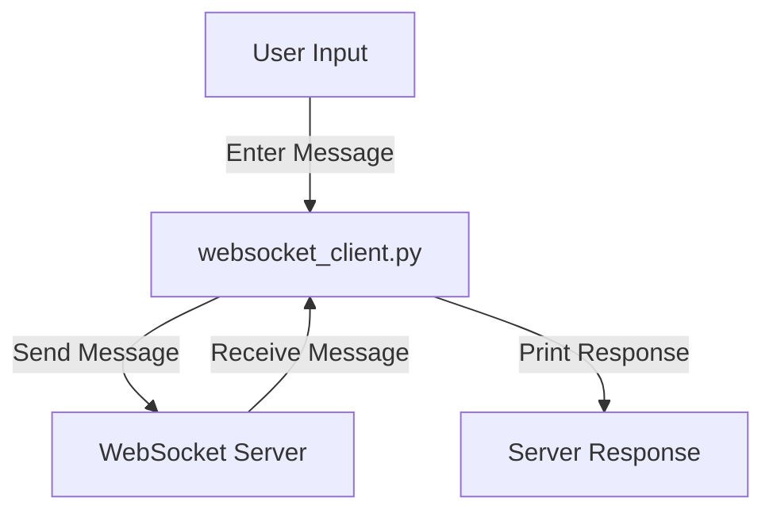

## Module: websocket_client.py
- **Module Name**: websocket_client.py
- **Primary Objectives**: This module is designed to establish a WebSocket connection with a MemGPT server. It can initialize a new agent or load an existing one, send user messages to the agent, and receive responses from the server.
- **Critical Functions**: 
   - `basic_cli_client()`: Main function that establishes the WebSocket connection and handles the communication with the server.
- **Key Variables**: 
   - `DEFAULT_PORT`: The default port for the WebSocket connection.
   - `CLIENT_TIMEOUT`: The maximum time to wait for a server response.
   - `CLEAN_RESPONSES`: A flag to determine whether to print raw server responses or cleaner ones.
   - `LOAD_AGENT`: The ID of an existing agent to load. If `None`, a new agent is created.
- **Interdependencies**: This module interacts with the following components:
   - `websockets`: Used to establish the WebSocket connection.
   - `asyncio`: Used for asynchronous I/O operations.
   - `memgpt.server.websocket_protocol`: Used for creating the load and create commands and user messages.
   - `memgpt.server.websocket_server`: The server with which this client communicates.
   - `memgpt.server.utils`: Used for utility functions like checking the condition to stop receiving responses.
- **Core vs. Auxiliary Operations**: The core operation is the interaction with the MemGPT server, including sending user messages and receiving responses. Auxiliary operations include loading or creating an agent and handling timeouts or connection errors.
- **Operational Sequence**: The module first establishes a WebSocket connection, then either loads an existing agent or creates a new one. It then enters a loop where it sends user messages to the server and waits for responses. This process continues until the connection is closed or an error occurs.
- **Performance Aspects**: The module uses asynchronous operations to avoid blocking while waiting for server responses. It also includes error handling for timeouts and connection errors.
- **Reusability**: This module can be reused to communicate with any MemGPT server. The agent configuration and user messages can be customized as needed.
- **Usage**: This module is used as a client to communicate with a MemGPT server. It can be run as a standalone script.
- **Assumptions**: The module assumes that a MemGPT server is running and accessible at the specified port. It also assumes that the user will input messages when prompted.
## Mermaid Diagram

