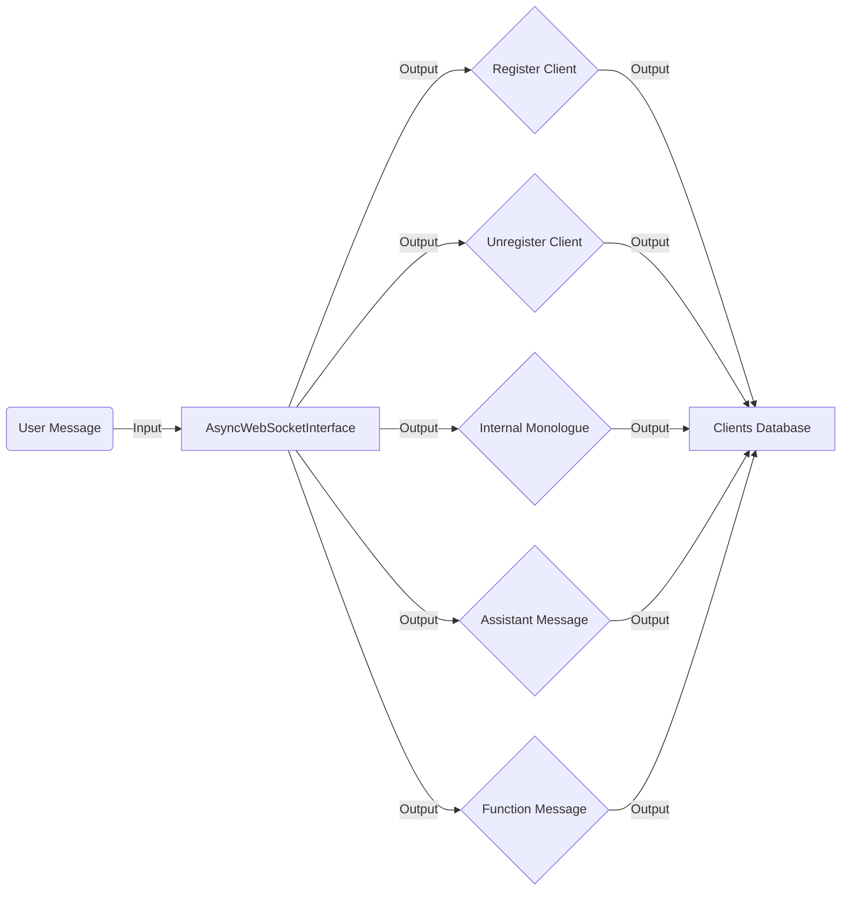

## Module: websocket_interface.py
- **Module Name**: websocket_interface.py

- **Primary Objectives**: This module is designed to facilitate communication between a MemGPT agent and clients over a WebSocket. It supports both synchronous and asynchronous messaging.

- **Critical Functions**: 
  - `register_client(self, websocket)`: Registers a new client connection.
  - `unregister_client(self, websocket)`: Unregisters a client connection.
  - `user_message(self, msg)`: Handles the reception of a user message.
  - `internal_monologue(self, msg)`: Handles the agent's internal monologue.
  - `assistant_message(self, msg)`: Handles the agent sending a message.
  - `function_message(self, msg)`: Handles the agent calling a function.
  - `_run_event_loop(self)`: Runs the dedicated event loop and handles its closure.
  - `_run_async(self, coroutine)`: Schedules coroutine to be run in the dedicated event loop.
  - `_send_to_all_clients(self, clients, msg)`: Asynchronously sends a message to all clients.
  - `close(self)`: Shuts down the WebSocket interface and its event loop.

- **Key Variables**: 
  - `self.clients`: A set of all currently connected clients.
  - `self.loop`: A new event loop created for the synchronous WebSocket interface.
  - `self.thread`: A thread for running the event loop in the synchronous WebSocket interface.

- **Interdependencies**: This module interacts with the `memgpt.interface` and `memgpt.server.websocket_protocol` modules.

- **Core vs. Auxiliary Operations**: The core operations involve handling messages from the user, the agent's internal monologue, the agent sending a message, and the agent calling a function. Auxiliary operations include registering and unregistering clients, running the event loop, and scheduling coroutines.

- **Operational Sequence**: The sequence typically begins with registering a client, then receiving and handling messages from the user or the agent, and sending responses back to the client. For the synchronous interface, an event loop is started in a separate thread.

- **Performance Aspects**: The module is designed to handle multiple clients and messages concurrently, which can improve throughput and responsiveness. However, the performance may be affected by the number of clients and the load on the event loop.

- **Reusability**: The module is highly reusable. It provides a base interface that can be extended to handle different types of messages and protocols. The synchronous and asynchronous interfaces can be used in different scenarios depending on the requirements.

- **Usage**: This module is used to enable communication between a MemGPT agent and clients over a WebSocket. The clients can send messages to the agent, and the agent can send responses back to the clients.

- **Assumptions**: The module assumes that the WebSocket connections are reliable and that the clients and the agent follow the correct message protocols. It also assumes that the event loop in the synchronous interface can handle the load of the tasks scheduled on it.
## Mermaid Diagram

