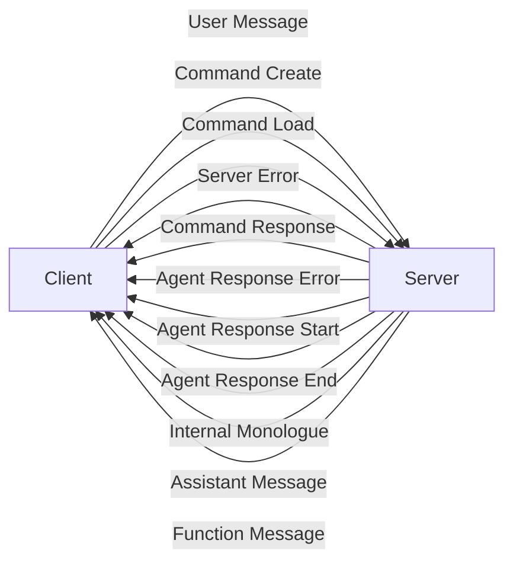

## Module: websocket_protocol.py
- **Module Name**: The module is named as `websocket_protocol.py`.

- **Primary Objectives**: The primary objective of this module is to handle the communication between the server and the client using WebSockets. It defines various functions to create and send JSON-based messages for different scenarios.

- **Critical Functions**: 
  - `server_error(msg)`: Sends a server error message.
  - `server_command_response(status)`: Sends a command response with a given status.
  - `server_agent_response_error(msg)`: Sends an agent response error message.
  - `server_agent_response_start()`: Sends a start signal for agent response.
  - `server_agent_response_end()`: Sends an end signal for agent response.
  - `server_agent_internal_monologue(msg)`: Sends an internal monologue message from the agent.
  - `server_agent_assistant_message(msg)`: Sends a message from the assistant agent.
  - `server_agent_function_message(msg)`: Sends a function message from the agent.
  - `client_user_message(msg, agent_name=None)`: Sends a user message, optionally with the agent's name.
  - `client_command_create(config)`: Sends a command to create an agent with a given configuration.
  - `client_command_load(agent_name)`: Sends a command to load an agent with a given name.

- **Key Variables**: The key variables in this module are the message (`msg`), status (`status`), agent name (`agent_name`), and configuration (`config`).

- **Interdependencies**: This module is likely to interact with both the server and client modules in the system.

- **Core vs. Auxiliary Operations**: Core operations include sending and receiving various types of messages between the server and client. Auxiliary operations might include formatting the messages or handling errors.

- **Operational Sequence**: The operational sequence is not explicitly defined in this module. However, it can be inferred that messages are sent and received in response to certain events or commands.

- **Performance Aspects**: Performance considerations are not explicitly mentioned in this module. However, the use of JSON for message formatting suggests a focus on lightweight data interchange.

- **Reusability**: This module appears to be highly reusable. The functions provided can be used to handle a variety of communication scenarios between a server and client.

- **Usage**: This module is used to handle server-client communication in a WebSocket context. The functions can be used to send different types of messages based on the situation.

- **Assumptions**: The code assumes that the server and client are capable of handling JSON-based messages. It also assumes that an appropriate WebSocket connection exists between the server and client.
## Mermaid Diagram

