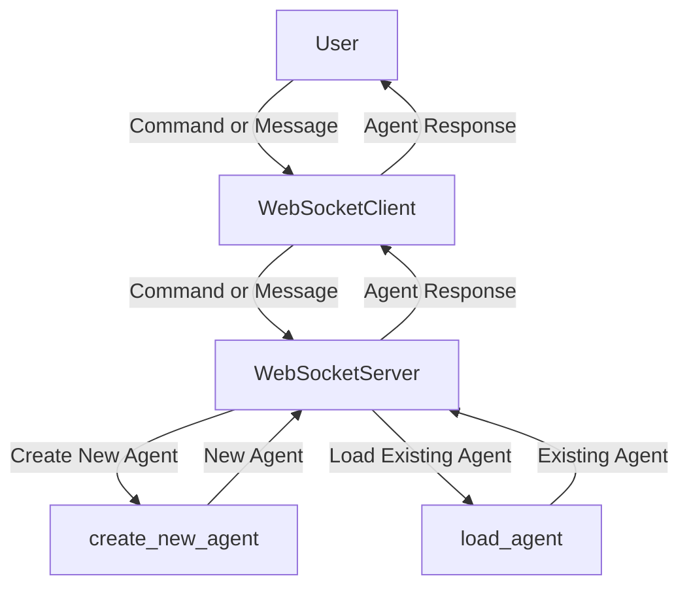

## Module: websocket_server.py
- **Module Name**: websocket_server.py

- **Primary Objectives**: This module is designed to create a WebSocket server that can handle various client requests, such as creating a new AI agent, loading an existing agent, and processing user messages. 

- **Critical Functions**: 
    - `__init__(self, host="localhost", port=DEFAULT_PORT)`: Initializes the WebSocket server with default host as localhost and port as DEFAULT_PORT.
    - `run_step(self, user_message, first_message=False, no_verify=False)`: Runs a step in the agent's conversation based on the user's message.
    - `handle_client(self, websocket, path)`: Handles client connections and manages incoming messages from the client.
    - `create_new_agent(self, config)`: Creates a new AI agent based on the provided configuration.
    - `load_agent(self, agent_name)`: Loads an existing AI agent based on the agent's name.
    - `initialize_server(self)`: Initializes the server.
    - `start_server(self)`: Starts the server.
    - `run(self)`: Runs the server.

- **Key Variables**: 
    - `self.host`: The host on which the server is running.
    - `self.port`: The port on which the server is running.
    - `self.interface`: The interface for the server.
    - `self.agent`: The AI agent that the server is currently working with.
    - `self.agent_name`: The name of the AI agent that the server is currently working with.

- **Interdependencies**: This module interacts with several other modules such as `memgpt.server.websocket_interface`, `memgpt.server.constants`, `memgpt.server.websocket_protocol`, `memgpt.system`, and `memgpt.constants`.

- **Core vs. Auxiliary Operations**: Core operations include handling client requests and managing AI agents (creating, loading, and processing user messages). Auxiliary operations include initializing and running the server.

- **Operational Sequence**: The server is initialized, then it starts and waits for client connections. When a client connects, it handles the client's requests which could be creating a new agent, loading an existing agent, or processing a user message.

- **Performance Aspects**: This module uses asynchronous programming (async/await) to handle client requests, which can improve the server's performance by allowing it to handle multiple requests concurrently.

- **Reusability**: This module is highly reusable. The WebSocket server can be used to manage AI agents in different contexts. The methods for creating and loading agents can also be reused in other modules or applications.

- **Usage**: This module is used to create a WebSocket server that can handle various client requests related to AI agents.

- **Assumptions**: The module assumes that the client will send JSON formatted data. It also assumes that the client will send valid commands and that the necessary agent configurations exist when an agent is being created or loaded.
## Mermaid Diagram

