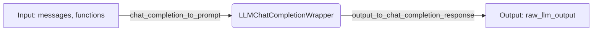

## Module: wrapper_base.py
- **Module Name**: The module is named `wrapper_base.py`.

- **Primary Objectives**: This module is designed to provide an abstract base class (ABC) for a chat completion wrapper. This wrapper is responsible for converting chat completion to a single prompt string and transforming the LLM output string into a chat completion response. 

- **Critical Functions**: The module contains two abstract methods:
  1. `chat_completion_to_prompt(self, messages, functions)`: This method is supposed to convert a ChatCompletion object into a single prompt string.
  2. `output_to_chat_completion_response(self, raw_llm_output)`: This method is supposed to convert the raw output from the LLM into a ChatCompletion response.

- **Key Variables**: The key variables are `messages`, `functions`, and `raw_llm_output`. The `messages` and `functions` are inputs for the `chat_completion_to_prompt` method, and `raw_llm_output` is an input for the `output_to_chat_completion_response` method.

- **Interdependencies**: This module is likely to interact with other modules that implement this abstract base class. The interactions would occur when the abstract methods are called and overridden. In addition, it depends on the `abc` module from Python's standard library.

- **Core vs. Auxiliary Operations**: The core operations of this module are the two abstract methods. There are no auxiliary operations as this is a base class providing an interface for other classes to implement.

- **Operational Sequence**: Being an abstract base class, it doesn't have a distinct operational sequence. The sequence will depend on the specific implementation in the child class.

- **Performance Aspects**: Performance considerations are not directly applicable to this module as it provides abstract methods. However, the performance of the child classes can be affected by how efficiently these methods are implemented.

- **Reusability**: This module is highly reusable. It provides a template for creating new classes that transform chat completion to a single prompt string and LLM output to a chat completion response.

- **Usage**: This module is used by creating a child class and implementing the abstract methods. The child class can then be used to convert between chat completions and LLM outputs.

- **Assumptions**: The module assumes that any class that inherits from it will provide concrete implementations of the abstract methods. It also assumes that the inputs to these methods will be in the expected format.
## Mermaid Diagram

