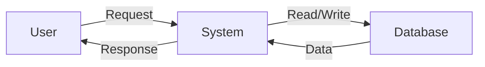

## Module: zephyr.py
- **Module Name**: ZephyrMistralWrapper and ZephyrMistralInnerMonologueWrapper

- **Primary Objectives**: The primary purpose of this module is to serve as a wrapper for Zephyr Alpha and Beta, Mistral 7B models. It formats a prompt that generates JSON, with or without inner thoughts.

- **Critical Functions**: 
    - `__init__`: Initializes the wrapper with various parameters.
    - `chat_completion_to_prompt`: Converts the chat messages and functions into a formatted prompt for the model.
    - `create_function_description`: Creates a string description of a function schema.
    - `create_function_call`: Creates a function call in JSON format.
    - `clean_function_args`: Performs some basic cleaning of function arguments.
    - `output_to_chat_completion_response`: Converts the raw output of the model into a formatted response.

- **Key Variables**: 
    - `simplify_json_content`: Determines whether to simplify the JSON content.
    - `clean_func_args`: Determines whether to clean function arguments.
    - `include_assistant_prefix`: Determines whether to include an assistant prefix in the prompt.
    - `include_opening_brance_in_prefix`: Determines whether to include an opening brace in the prefix.
    - `include_section_separators`: Determines whether to include section separators in the prompt.

- **Interdependencies**: This module interacts with other system components like the json parser and the LLMChatCompletionWrapper.

- **Core vs. Auxiliary Operations**: Core operations include the generation of the prompt and the conversion of the model's raw output into a formatted response. Auxiliary operations include the creation of function descriptions and function calls and the cleaning of function arguments.

- **Operational Sequence**: The module first initializes with the given parameters. It then converts chat messages and functions into a formatted prompt, which is fed into the model. The model's raw output is then converted into a formatted response.

- **Performance Aspects**: The module's performance mainly depends on the underlying model's performance. The efficiency of the functions for prompt creation and output formatting also impacts the overall performance.

- **Reusability**: The module is highly reusable. It can be used with any chat data and functions, provided they are in the required format.

- **Usage**: The module is used by initializing it with the required parameters, calling `chat_completion_to_prompt` with the chat messages and functions, running the model with the generated prompt, and then converting the model's output into a response using `output_to_chat_completion_response`.

- **Assumptions**: The module assumes that the chat messages and functions are in a specific format. It also assumes that the model's output is in JSON format.
## Mermaid Diagram

