# Introduction :

AI_CLI.py is a sophisticated module designed to function as the command-line interface (CLI) for an AI chatbot. The primary purpose of this module is to facilitate seamless interaction between the user and the AI system. It achieves this by communicating with a local API endpoint, which is responsible for generating appropriate responses to user inputs.

The module works in a straightforward manner. A user inputs a command or question into the system, and the module processes this input and sends it to the local API endpoint. The endpoint then processes the input, generates a response, and sends it back to the AI_CLI.py module. The module then displays this response to the user, completing the interaction loop.

The purpose of this system is multi-fold. Firstly, it provides users with an easy-to-use interface for interacting with the AI system, which can be particularly useful for those who may not be comfortable with more complex interfaces. Secondly, by communicating with a local API endpoint, the system ensures that responses are generated quickly and efficiently, providing a smooth and satisfying user experience. Lastly, the use of a local API endpoint also enhances the system's security, as all data is processed locally and does not need to be transmitted over the internet.

Overall, AI_CLI.py acts as a crucial link between the user and the AI system, ensuring that the interaction is efficient, secure, and user-friendly.

# Full System Overview

# Module Overview
## Module: AI_CLI.py
- **Module Name**: AI_CLI.py

- **Primary Objectives**: This module serves as a command-line interface (CLI) for an AI chatbot. It communicates with a local API endpoint to generate responses to user inputs.

- **Critical Functions**: 
    - `clear_history()`: Clears the chat history and terminal screen.
    - `get_prompt_template(model_name, prompt)`: Returns a prompt template based on the model name.
    - `handle_command(user_input)`: Handles special commands such as clearing history, entering multiline input mode, and displaying help.
    - `print_help()`: Prints the available commands.
    - `process_user_input()`: Processes user input, either in single-line or multi-line mode.
    - `get_user_input()`: Calls `process_user_input()` to get the user's input.
    - Main loop: Continuously gets user input, checks for commands, sends requests to the local API, and prints the assistant's response.

- **Key Variables**: 
    - `api_url`: The URL for the local API endpoint.
    - `headers`: The headers for the HTTP request.
    - `history`: The chat history.
    - `system_message`: System message for Mistral models.
    - `multiline_input`: Flag to indicate if multi-line input is active.

- **Interdependencies**: This module interacts with a local API endpoint, which is presumably responsible for generating the AI's responses.

- **Core vs. Auxiliary Operations**: 
    - Core: The main loop that gets user input, sends requests to the API, and prints responses.
    - Auxiliary: Functions that handle commands, process user input, and clear the chat history.

- **Operational Sequence**: The script enters an infinite loop where it continuously gets user input, checks for commands, sends requests to the local API based on the input, and prints the assistant's response.

- **Performance Aspects**: Performance considerations are not explicitly mentioned in the code. However, the performance of this script will largely depend on the response time of the local API.

- **Reusability**: This module is fairly reusable. The `get_prompt_template()` function can be easily extended to support more models. The command handling mechanism can also be extended to support more commands. The main loop and the way it interacts with the API are fairly generic and could be adapted to different chatbot applications.
## Mermaid Diagram

