# Introduction :

The system is a simulation program designed to emulate a wanderer's journey on an island map. The program is divided into several modules, each with a specific function.

1. `file_handler.py`: This module is responsible for opening files using the default system handler. It's a utility module for handling file operations.

2. `main.py`: This is the core module of the program. It initializes the island map, sets the initial positions, and simulates the wanderer's movement across the island. The wanderer encounters various events such as food, spikes, exits, or water. The simulation ends when the wanderer escapes, starves, or drowns. The final statistics and maps are then displayed based on the debug flags.

3. `maps.py`: This module provides functions to manipulate and interact with map data, which are represented as 2D lists (matrices) in Python.

4. `navigation.py`: This module handles navigation-related tasks within the island map. It includes functions for finding positions of specific elements, updating the positions of bridges, checking if a movement is at a bridge exit or on a specific event type, updating the movement position randomly, generating a smart movement direction, and checking if a value is even.

5. `stats.py`: This module maintains and displays statistics related to the game. It tracks the number of times the Wanderer has escaped, drowned, or starved and prints the total number of lives.

The ultimate purpose of the system is to provide an engaging and dynamic simulation of a wanderer's journey, complete with various challenges and obstacles. The system is designed to be flexible, with each module serving a specific function, allowing for easy updates and modifications to the game's mechanics.

# Full System Overview

# Module Overview
## Module: file_handler.py
- **Module Name**: The module's name is `file_handler.py`.

- **Primary Objectives**: The main purpose of this module is to open a file using the default system handler. It is a simple utility for file handling operations.

- **Critical Functions**: 
  - `open_file(path)`: This is the main function of the module. It takes a file path as an argument and opens the file using the system's default file handler.

- **Key Variables**: 
  - `path`: This is the main variable in the module. It is a string that holds the path to the file to be opened.

- **Interdependencies**: This module depends on the `os` module for interacting with the operating system.

- **Core vs. Auxiliary Operations**: The core operation of this module is to open a file. There are no auxiliary operations in this module.

- **Operational Sequence**: The module begins by importing the `os` module. Then it defines the `open_file(path)` function. When this function is called with a file path as an argument, it opens the file using the system's default file handler.

- **Performance Aspects**: The performance of this module depends on the performance of the `os.system()` function. If the system's default file handler is slow, this will slow down the `open_file(path)` function.

- **Reusability**: This module is highly reusable. The `open_file(path)` function can be used in any Python program that needs to open a file. However, it should be noted that this function uses the `os.system()` function, which is not recommended for use in production code because it can be a security hazard. If you plan to reuse this function in production code, consider replacing `os.system()` with a safer alternative.
## Mermaid Diagram

## Module: main.py
- **Module Name**: The module's name is `main.py`.

- **Primary Objectives**: The module's purpose is to simulate a wanderer's journey on an island map. It initializes the island map, sets initial positions, and simulates the wanderer's movement, encountering events such as food, spikes, exits, or water. The simulation stops when the wanderer escapes, starves, or drowns. The final statistics and maps are printed based on the debug flags.

- **Critical Functions**: The main function is `engine(debug1=False, debug2=False, debug3=False)`. This function carries out the simulation of the wanderer's journey. Key methods within this function include:
    - `maps.get_map_dim(TextFile["Map2"])`
    - `maps.load_map(TextFile["Map2"], map_dimensions)`
    - `maps.create_blank_map(map_dimensions)`
    - `navigation.update_bridge_pos(island_map, map_dimensions)`
    - `navigation.get_pos(island_map, event["Start Position"])`
    - `navigation.rand_update_movement_pos(movement_map, movement_xy, True)`
    - `navigation.on_event_type(island_map, movement_xy, event["Food"])`
    - `stats.print_all_stats()`
    - `maps.print_list_of_maps(escaped_maps)`

- **Key Variables**: Key variables include `event`, `TextFile`, `escaped_maps`, `starved_maps`, `drowned_maps`, `map_dimensions`, `island_map`, `movement_map`, `initial_xy`, `movement_xy`, `lives`, and `steps`.

- **Interdependencies**: This module relies on other modules such as `stats.stats`, `maps.maps`, `navigation.navigation`, and `filehandler.file_handler`.

- **Core vs. Auxiliary Operations**: The core operation is the simulation of the wanderer's journey on the island map. Auxiliary operations include loading the map, updating the bridge positions, getting the position of the wanderer, updating the movement position, checking if the wanderer is on an event, and printing the statistics and maps.

- **Operational Sequence**: The operational sequence involves initializing the island map and wanderer's position, then entering a loop that simulates the wanderer's movement and interaction with events. This sequence continues until the wanderer escapes, starves, or drowns.

- **Performance Aspects**: The performance of this module would depend on the size of the island map and the number of events. Larger maps and more events would likely increase the computational complexity.

- **Reusability**: This module is highly reusable for any similar simulation involving a wanderer moving on a map and encountering various events. The map and events can be easily customized by modifying the `event` and `TextFile` variables.
## Mermaid Diagram

## Module: maps.py
- **Module Name**: The module's name is `maps.py`.

- **Primary Objectives**: The primary purpose of this module is to provide functions that manipulate and interact with map data. These maps are represented as 2D lists (matrices) in Python.

- **Critical Functions**: 
  - `print_list_of_maps()`: Prints a list of maps.
  - `print_matrix()`: Prints a matrix.
  - `create_blank_map()`: Creates a blank map with zeros.
  - `clear_matrix()`: Clears a matrix by setting all elements to zero.
  - `get_map_dim()`: Gets the dimensions of the map from a text file.
  - `load_map()`: Loads a map from a text file.

- **Key Variables**: 
  - `map_list`: A list containing maps.
  - `matrix_`: A matrix represented as a list of lists.
  - `dim`: A 2-element list representing the dimensions of the map or matrix.
  - `map_txt`: The name of the text file containing the map.

- **Interdependencies**: This module does not appear to depend directly on other modules, but it does rely on Python's built-in functionality for handling files and lists.

- **Core vs. Auxiliary Operations**: Core operations involve creating, loading, and clearing maps or matrices. Auxiliary operations involve printing maps or matrices and getting map dimensions.

- **Operational Sequence**: Typically, a map's dimensions are first retrieved with `get_map_dim()`, then the map is loaded with `load_map()`. After that, the map can be manipulated (e.g., cleared with `clear_matrix()` or filled with `create_blank_map()`) and printed out (with `print_list_of_maps()` or `print_matrix()`).

- **Performance Aspects**: This module reads maps from files, which can be slow if the maps are large. It also iterates over entire maps multiple times, which has a time complexity of O(n), where n is the number of elements in the map.

- **Reusability**: This module's functions are quite general and can be used for any operations involving 2D lists, not just "maps". They could be reused in any context where 2D data manipulation is needed.
## Mermaid Diagram

## Module: navigation.py
- **Module Name**: navigation.py

- **Primary Objectives**: The purpose of this module is to handle navigation-related tasks within a grid or island map. This includes finding positions of specific elements, updating the positions of bridges, checking if a movement is at a bridge exit, checking if a movement is on a specific event type, updating the movement position randomly, generating a smart movement direction, and checking if a value is even.

- **Critical Functions**: 
  - `get_pos(island_map, event_type=1)`: Finds the position of a specified event type in the island map.
  - `update_bridge_pos(island_map, map_dimensions)`: Updates the positions of the two bridges on the island map.
  - `at_exit(movement_xy)`: Checks if the movement is at one of the bridge exits.
  - `on_event_type(island_map, movement_xy, event_type)`: Checks if the movement is on a specific event type.
  - `rand_update_movement_pos(movement_map, movement_xy, smart_move=False)`: Updates the movement position randomly.
  - `smart_movement(last_dir)`: Generates a smart movement direction.
  - `is_even(value)`: Checks if a value is even.

- **Key Variables**:
  - `bridge1_xy` and `bridge2_xy`: Store the positions of the two bridges.
  - `direction`: A dictionary that maps different directions to integers.
  - `movement_xy`: A list that stores the current movement position.

- **Interdependencies**: This module doesn't seem to depend on other modules. However, it expects certain data structures such as `island_map` and `movement_map`, which are likely provided by other parts of the system.

- **Core vs. Auxiliary Operations**: 
  - Core operations include getting positions, updating bridge positions, checking if the movement is at an exit or on a specific event type, and updating movement position.
  - Auxiliary operations include the `smart_movement` function which generates a smart movement direction based on the last direction and the `is_even` function which checks if a value is even.

- **Operational Sequence**: The operational sequence isn't explicitly defined in the module, but typically, the bridge positions would be updated first (`update_bridge_pos`), then the movement position would be updated (`rand_update_movement_pos`), and checks would be performed (`at_exit`, `on_event_type`).

- **Performance Aspects**: The module uses simple iterations and condition checks, so it should be fairly efficient. However, the `get_pos` function could be slow for large maps as it iterates over every element.

- **Reusability**: The functions in this module are fairly specific to the navigation tasks in this particular context (an island map with bridges and specific event types). However, some functions like `is_even` or the concept of updating positions could be reused in other similar contexts.
## Mermaid Diagram

## Module: stats.py
- **Module Name**: The module is named `stats.py`.

- **Primary Objectives**: The primary purpose of this module is to maintain and display statistics related to the "Wanderer" game. It tracks the number of times the Wanderer has escaped, drowned, or starved, and it also prints the total number of lives.

- **Critical Functions**: 
  - `print_event_positions(event_xy)`: This function prints the x, y coordinates of events.
  - `print_lives()`: This function prints the total number of lives.
  - `print_escaped()`: This function prints the number of times the Wanderer has escaped.
  - `print_drowned()`: This function prints the number of times the Wanderer has drowned.
  - `print_starved()`: This function prints the number of times the Wanderer has starved.
  - `print_all_stats()`: This function prints all the statistics, including total lives, escapes, drownings, and starvations.

- **Key Variables**: 
  - `escaped_count`: Number of times the Wanderer has escaped.
  - `starved_count`: Number of times the Wanderer has starved.
  - `drowned_count`: Number of times the Wanderer has drowned.

- **Interdependencies**: This module does not appear to have direct dependencies on other system components as per the provided code. It seems to operate independently.

- **Core vs. Auxiliary Operations**: The core operations of this module are the functions that print the statistics (`print_lives()`, `print_escaped()`, `print_drowned()`, `print_starved()`, `print_all_stats()`). The auxiliary operation is the `print_event_positions(event_xy)` function, which provides additional information about the event positions but is not directly related to the statistics tracking.

- **Operational Sequence**: The operational sequence is not explicitly defined in the code. However, typically, the statistics would be updated during the game, and the print functions would be called as needed to display the current statistics.

- **Performance Aspects**: This module is relatively simple and should not have significant performance implications. The most potentially costly operation, printing event positions, is a linear operation based on the number of events.

- **Reusability**: This module is fairly specific to the Wanderer game, but the concept of tracking and printing statistics could be adapted for other similar games or applications. The print functions, in particular, are quite generic and could be reused with minor modifications.
## Mermaid Diagram

