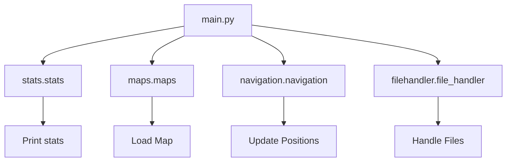

## Module: main.py
- **Module Name**: The module's name is `main.py`.

- **Primary Objectives**: The module's purpose is to simulate a wanderer's journey on an island map. It initializes the island map, sets initial positions, and simulates the wanderer's movement, encountering events such as food, spikes, exits, or water. The simulation stops when the wanderer escapes, starves, or drowns. The final statistics and maps are printed based on the debug flags.

- **Critical Functions**: The main function is `engine(debug1=False, debug2=False, debug3=False)`. This function carries out the simulation of the wanderer's journey. Key methods within this function include:
    - `maps.get_map_dim(TextFile["Map2"])`
    - `maps.load_map(TextFile["Map2"], map_dimensions)`
    - `maps.create_blank_map(map_dimensions)`
    - `navigation.update_bridge_pos(island_map, map_dimensions)`
    - `navigation.get_pos(island_map, event["Start Position"])`
    - `navigation.rand_update_movement_pos(movement_map, movement_xy, True)`
    - `navigation.on_event_type(island_map, movement_xy, event["Food"])`
    - `stats.print_all_stats()`
    - `maps.print_list_of_maps(escaped_maps)`

- **Key Variables**: Key variables include `event`, `TextFile`, `escaped_maps`, `starved_maps`, `drowned_maps`, `map_dimensions`, `island_map`, `movement_map`, `initial_xy`, `movement_xy`, `lives`, and `steps`.

- **Interdependencies**: This module relies on other modules such as `stats.stats`, `maps.maps`, `navigation.navigation`, and `filehandler.file_handler`.

- **Core vs. Auxiliary Operations**: The core operation is the simulation of the wanderer's journey on the island map. Auxiliary operations include loading the map, updating the bridge positions, getting the position of the wanderer, updating the movement position, checking if the wanderer is on an event, and printing the statistics and maps.

- **Operational Sequence**: The operational sequence involves initializing the island map and wanderer's position, then entering a loop that simulates the wanderer's movement and interaction with events. This sequence continues until the wanderer escapes, starves, or drowns.

- **Performance Aspects**: The performance of this module would depend on the size of the island map and the number of events. Larger maps and more events would likely increase the computational complexity.

- **Reusability**: This module is highly reusable for any similar simulation involving a wanderer moving on a map and encountering various events. The map and events can be easily customized by modifying the `event` and `TextFile` variables.
## Mermaid Diagram

