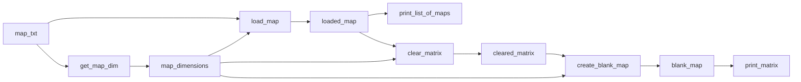

## Module: maps.py
- **Module Name**: The module's name is `maps.py`.

- **Primary Objectives**: The primary purpose of this module is to provide functions that manipulate and interact with map data. These maps are represented as 2D lists (matrices) in Python.

- **Critical Functions**: 
  - `print_list_of_maps()`: Prints a list of maps.
  - `print_matrix()`: Prints a matrix.
  - `create_blank_map()`: Creates a blank map with zeros.
  - `clear_matrix()`: Clears a matrix by setting all elements to zero.
  - `get_map_dim()`: Gets the dimensions of the map from a text file.
  - `load_map()`: Loads a map from a text file.

- **Key Variables**: 
  - `map_list`: A list containing maps.
  - `matrix_`: A matrix represented as a list of lists.
  - `dim`: A 2-element list representing the dimensions of the map or matrix.
  - `map_txt`: The name of the text file containing the map.

- **Interdependencies**: This module does not appear to depend directly on other modules, but it does rely on Python's built-in functionality for handling files and lists.

- **Core vs. Auxiliary Operations**: Core operations involve creating, loading, and clearing maps or matrices. Auxiliary operations involve printing maps or matrices and getting map dimensions.

- **Operational Sequence**: Typically, a map's dimensions are first retrieved with `get_map_dim()`, then the map is loaded with `load_map()`. After that, the map can be manipulated (e.g., cleared with `clear_matrix()` or filled with `create_blank_map()`) and printed out (with `print_list_of_maps()` or `print_matrix()`).

- **Performance Aspects**: This module reads maps from files, which can be slow if the maps are large. It also iterates over entire maps multiple times, which has a time complexity of O(n), where n is the number of elements in the map.

- **Reusability**: This module's functions are quite general and can be used for any operations involving 2D lists, not just "maps". They could be reused in any context where 2D data manipulation is needed.
## Mermaid Diagram

