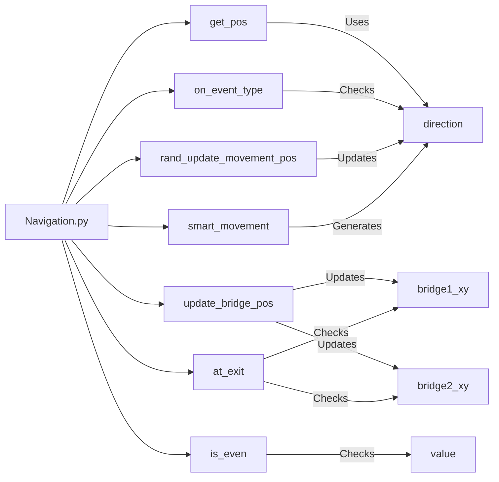

## Module: navigation.py
- **Module Name**: navigation.py

- **Primary Objectives**: The purpose of this module is to handle navigation-related tasks within a grid or island map. This includes finding positions of specific elements, updating the positions of bridges, checking if a movement is at a bridge exit, checking if a movement is on a specific event type, updating the movement position randomly, generating a smart movement direction, and checking if a value is even.

- **Critical Functions**: 
  - `get_pos(island_map, event_type=1)`: Finds the position of a specified event type in the island map.
  - `update_bridge_pos(island_map, map_dimensions)`: Updates the positions of the two bridges on the island map.
  - `at_exit(movement_xy)`: Checks if the movement is at one of the bridge exits.
  - `on_event_type(island_map, movement_xy, event_type)`: Checks if the movement is on a specific event type.
  - `rand_update_movement_pos(movement_map, movement_xy, smart_move=False)`: Updates the movement position randomly.
  - `smart_movement(last_dir)`: Generates a smart movement direction.
  - `is_even(value)`: Checks if a value is even.

- **Key Variables**:
  - `bridge1_xy` and `bridge2_xy`: Store the positions of the two bridges.
  - `direction`: A dictionary that maps different directions to integers.
  - `movement_xy`: A list that stores the current movement position.

- **Interdependencies**: This module doesn't seem to depend on other modules. However, it expects certain data structures such as `island_map` and `movement_map`, which are likely provided by other parts of the system.

- **Core vs. Auxiliary Operations**: 
  - Core operations include getting positions, updating bridge positions, checking if the movement is at an exit or on a specific event type, and updating movement position.
  - Auxiliary operations include the `smart_movement` function which generates a smart movement direction based on the last direction and the `is_even` function which checks if a value is even.

- **Operational Sequence**: The operational sequence isn't explicitly defined in the module, but typically, the bridge positions would be updated first (`update_bridge_pos`), then the movement position would be updated (`rand_update_movement_pos`), and checks would be performed (`at_exit`, `on_event_type`).

- **Performance Aspects**: The module uses simple iterations and condition checks, so it should be fairly efficient. However, the `get_pos` function could be slow for large maps as it iterates over every element.

- **Reusability**: The functions in this module are fairly specific to the navigation tasks in this particular context (an island map with bridges and specific event types). However, some functions like `is_even` or the concept of updating positions could be reused in other similar contexts.
## Mermaid Diagram

