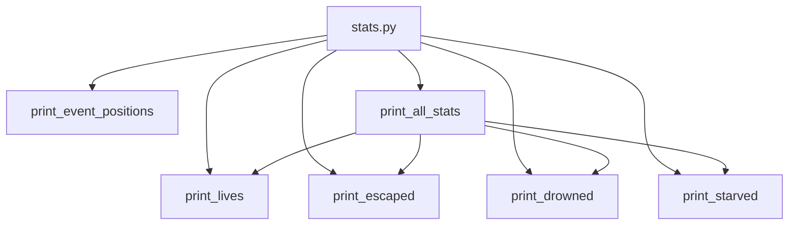

## Module: stats.py
- **Module Name**: The module is named `stats.py`.

- **Primary Objectives**: The primary purpose of this module is to maintain and display statistics related to the "Wanderer" game. It tracks the number of times the Wanderer has escaped, drowned, or starved, and it also prints the total number of lives.

- **Critical Functions**: 
  - `print_event_positions(event_xy)`: This function prints the x, y coordinates of events.
  - `print_lives()`: This function prints the total number of lives.
  - `print_escaped()`: This function prints the number of times the Wanderer has escaped.
  - `print_drowned()`: This function prints the number of times the Wanderer has drowned.
  - `print_starved()`: This function prints the number of times the Wanderer has starved.
  - `print_all_stats()`: This function prints all the statistics, including total lives, escapes, drownings, and starvations.

- **Key Variables**: 
  - `escaped_count`: Number of times the Wanderer has escaped.
  - `starved_count`: Number of times the Wanderer has starved.
  - `drowned_count`: Number of times the Wanderer has drowned.

- **Interdependencies**: This module does not appear to have direct dependencies on other system components as per the provided code. It seems to operate independently.

- **Core vs. Auxiliary Operations**: The core operations of this module are the functions that print the statistics (`print_lives()`, `print_escaped()`, `print_drowned()`, `print_starved()`, `print_all_stats()`). The auxiliary operation is the `print_event_positions(event_xy)` function, which provides additional information about the event positions but is not directly related to the statistics tracking.

- **Operational Sequence**: The operational sequence is not explicitly defined in the code. However, typically, the statistics would be updated during the game, and the print functions would be called as needed to display the current statistics.

- **Performance Aspects**: This module is relatively simple and should not have significant performance implications. The most potentially costly operation, printing event positions, is a linear operation based on the number of events.

- **Reusability**: This module is fairly specific to the Wanderer game, but the concept of tracking and printing statistics could be adapted for other similar games or applications. The print functions, in particular, are quite generic and could be reused with minor modifications.
## Mermaid Diagram

