# Introduction :

System Overview:

The system consists of three main modules: gesture_recognition.py, main.py, and spotify_functions.py. 

The gesture_recognition.py module is responsible for recognizing hand gestures using MediaPipe and OpenCV. It utilizes the webcam feed to detect and interpret hand gestures accurately. The primary objectives of this module are to control Spotify playback based on the recognized gestures. It supports various gestures such as play/pause, next/previous song, and volume control.

The main.py module acts as the central integration point for the system. Its primary objective is to combine the gesture recognition functionality with Spotify's functionality to control a user's Spotify account based on their gestures. It handles user authentication, initiates the gesture capturing process, and applies the recognized gestures to control the user's Spotify account effectively.

The spotify_functions.py module is responsible for interacting with Spotify's API using the Spotipy library. Its main purpose is to control music playback, adjust volume, and fetch user information from the Spotify account. This module provides the necessary functionality to play/pause songs, skip to the next/previous song, and adjust the volume level based on the recognized gestures.

Overall, the system aims to provide a seamless and intuitive way for users to control their Spotify account using hand gestures. By integrating gesture recognition with Spotify's API, users can easily navigate and control their music playback without the need for traditional input methods.

# Full System Overview

# Module Overview
## Module: gesture_recognition.py
- **Module Name**: gesture_recognition.py

- **Primary Objectives**: The purpose of this module is to recognize hand gestures using MediaPipe and OpenCV. It uses a webcam feed to detect and interpret hand gestures to control Spotify playback, including play/pause, next/previous song, and volume control.

- **Critical Functions**:
    - `start_capture()`: The main function that initiates the webcam feed, processes frames, identifies hand gestures, and controls Spotify playback based on these gestures.
    - `sf.adjust_volume(vol_percent)`: Adjusts Spotify's volume based on the recognized hand gesture.
    - `sf.play_pause()`: Toggles play/pause on Spotify based on the recognized hand gesture.
    - `sf.next_song()`: Moves to the next song on Spotify based on the recognized hand gesture.
    - `sf.prev_song()`: Moves to the previous song on Spotify based on the recognized hand gesture.

- **Key Variables**:
    - `mp_hand_drawing`, `mp_hands`: MediaPipe solutions objects for drawing utilities and hand solutions respectively.
    - `mediaCap`: Object for capturing video feed from the webcam.
    - `max_distance`, `play_pause_active`, `next_prev_active`: Variables to store the maximum distance for volume control and boolean flags for play/pause and next/previous song actions respectively.
    - `finger_tip_ids`, `finger_count`, `finger_up`: Variables to track finger tip landmarks, count of fingers up, and status of each finger (up or down) respectively.

- **Interdependencies**: This module relies on the `mediapipe`, `cv2`, `math`, `time`, and `spotify_functions` modules.

- **Core vs. Auxiliary Operations**: 
    - Core operations include capturing the video feed, processing each frame, detecting and interpreting hand gestures, and controlling Spotify playback.
    - Auxiliary operations include drawing hand landmarks on the frame, displaying the volume control UI, and handling keyboard input to quit the program.

- **Operational Sequence**: The program first initializes necessary objects and variables. It then enters a loop where it reads frames from the webcam, flips and processes them, detects hand landmarks, interprets gestures, and controls Spotify playback based on the interpreted gestures. The loop continues until 'q' is pressed.

- **Performance Aspects**: Performance depends on the quality and speed of the webcam feed, the efficiency of the MediaPipe hand detection, and the responsiveness of the Spotify controls. It also depends on the computational power of the machine running the program.

- **Reusability**: The module is specific to gesture recognition for Spotify control. However, the core parts of the code related to hand gesture recognition and interpretation can be reused for other applications with minor modifications. The Spotify control functions can also be replaced with other controls to adapt the module for different use cases.
## Mermaid Diagram

## Module: main.py
- **Module Name**: The module name is "main.py".

- **Primary Objectives**: The primary objective of this module is to integrate gesture recognition and Spotify functionality to control a Spotify account based on the user's gestures. It authenticates the user, initiates gesture capturing, and applies the recognized gestures to control the user's Spotify account.

- **Critical Functions**: 
  - `sf.get_user()`: This function is used to get the Spotify user's credentials for authentication.
  - `gr.start_capture()`: This function is used to start capturing the user's gestures.

- **Key Variables**: 
  - `username`: This variable is used to store the Spotify user's credentials.

- **Interdependencies**: This module relies on `gesture_recognition` and `spotify_functions` modules for its operations. It uses the `get_user` function from `spotify_functions` for user authentication and `start_capture` function from `gesture_recognition` to start capturing gestures.

- **Core vs. Auxiliary Operations**: The core operations of this module are user authentication and gesture capture. Printing the username is an auxiliary operation that provides user feedback but is not necessary for the main functionality.

- **Operational Sequence**: First, the module imports the necessary external modules. It then retrieves the Spotify user credentials, prints the username, and finally starts the gesture capturing process.

- **Performance Aspects**: The performance of this module depends on the efficiency of the `gesture_recognition` and `spotify_functions` modules. The speed and accuracy of gesture recognition and the responsiveness of the Spotify API will directly impact the performance.

- **Reusability**: The module's design is quite specific to its task, but the pattern of integrating two external modules (one for input capture and one for controlling an external service) could be reused in other contexts. The `username` retrieval and printing could also be reused for any application requiring Spotify user authentication.
## Mermaid Diagram

## Module: spotify_functions.py
- **Module Name**: spotify_functions.py

- **Primary Objectives**: This module is designed to interact with Spotify's API using the Spotipy library. Its main purpose is to control music playback, adjust volume, and fetch user information.

- **Critical Functions**:
  - `get_user()`: Fetches the Spotify username of the connected user.
  - `adjust_volume(vol_percent)`: Adjusts the playback volume to a given percentage (0-100%).
  - `play_pause()`: Checks the user's playback status and toggles between play and pause states.
  - `next_song()`: Skips to the next song in the queue.
  - `prev_song()`: Goes back to the previous song.

- **Key Variables**:
  - `SPOTIPY_CLIENT_ID`, `SPOTIPY_CLIENT_SECRET`, `SPOTIPY_REDIRECT_URI`: These are the credentials used for OAuth authentication with the Spotify API.
  - `scope`: Defines the permissions the app is requesting from the user.
  - `sp`: An instance of the Spotipy class, used to interact with the Spotify API.

- **Interdependencies**: This module interacts with the Spotify API and requires the Spotipy library. 

- **Core vs. Auxiliary Operations**: 
  - Core Operations: `get_user()`, `adjust_volume(vol_percent)`, `play_pause()`, `next_song()`, `prev_song()`.
  - Auxiliary Operations: Authentication and creation of the Spotipy object.

- **Operational Sequence**: After the Spotipy object is created with the necessary permissions, the functions can be called in any order based on user input or app requirements.

- **Performance Aspects**: Performance would largely depend on the response time of the Spotify API. Also, the `play_pause()` function could be optimized by directly passing the 'is_playing' status as a parameter instead of fetching it every time.

- **Reusability**: This module is highly reusable for any application that requires control over Spotify's playback. The functions are general and not tied to specific use cases. However, the Spotify credentials (`SPOTIPY_CLIENT_ID`, `SPOTIPY_CLIENT_SECRET`) would need to be replaced for each different application.
## Mermaid Diagram

