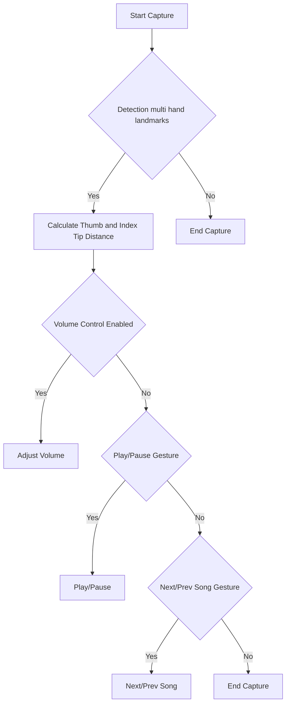

## Module: gesture_recognition.py
- **Module Name**: gesture_recognition.py

- **Primary Objectives**: The purpose of this module is to recognize hand gestures using MediaPipe and OpenCV. It uses a webcam feed to detect and interpret hand gestures to control Spotify playback, including play/pause, next/previous song, and volume control.

- **Critical Functions**:
    - `start_capture()`: The main function that initiates the webcam feed, processes frames, identifies hand gestures, and controls Spotify playback based on these gestures.
    - `sf.adjust_volume(vol_percent)`: Adjusts Spotify's volume based on the recognized hand gesture.
    - `sf.play_pause()`: Toggles play/pause on Spotify based on the recognized hand gesture.
    - `sf.next_song()`: Moves to the next song on Spotify based on the recognized hand gesture.
    - `sf.prev_song()`: Moves to the previous song on Spotify based on the recognized hand gesture.

- **Key Variables**:
    - `mp_hand_drawing`, `mp_hands`: MediaPipe solutions objects for drawing utilities and hand solutions respectively.
    - `mediaCap`: Object for capturing video feed from the webcam.
    - `max_distance`, `play_pause_active`, `next_prev_active`: Variables to store the maximum distance for volume control and boolean flags for play/pause and next/previous song actions respectively.
    - `finger_tip_ids`, `finger_count`, `finger_up`: Variables to track finger tip landmarks, count of fingers up, and status of each finger (up or down) respectively.

- **Interdependencies**: This module relies on the `mediapipe`, `cv2`, `math`, `time`, and `spotify_functions` modules.

- **Core vs. Auxiliary Operations**: 
    - Core operations include capturing the video feed, processing each frame, detecting and interpreting hand gestures, and controlling Spotify playback.
    - Auxiliary operations include drawing hand landmarks on the frame, displaying the volume control UI, and handling keyboard input to quit the program.

- **Operational Sequence**: The program first initializes necessary objects and variables. It then enters a loop where it reads frames from the webcam, flips and processes them, detects hand landmarks, interprets gestures, and controls Spotify playback based on the interpreted gestures. The loop continues until 'q' is pressed.

- **Performance Aspects**: Performance depends on the quality and speed of the webcam feed, the efficiency of the MediaPipe hand detection, and the responsiveness of the Spotify controls. It also depends on the computational power of the machine running the program.

- **Reusability**: The module is specific to gesture recognition for Spotify control. However, the core parts of the code related to hand gesture recognition and interpretation can be reused for other applications with minor modifications. The Spotify control functions can also be replaced with other controls to adapt the module for different use cases.
## Mermaid Diagram

