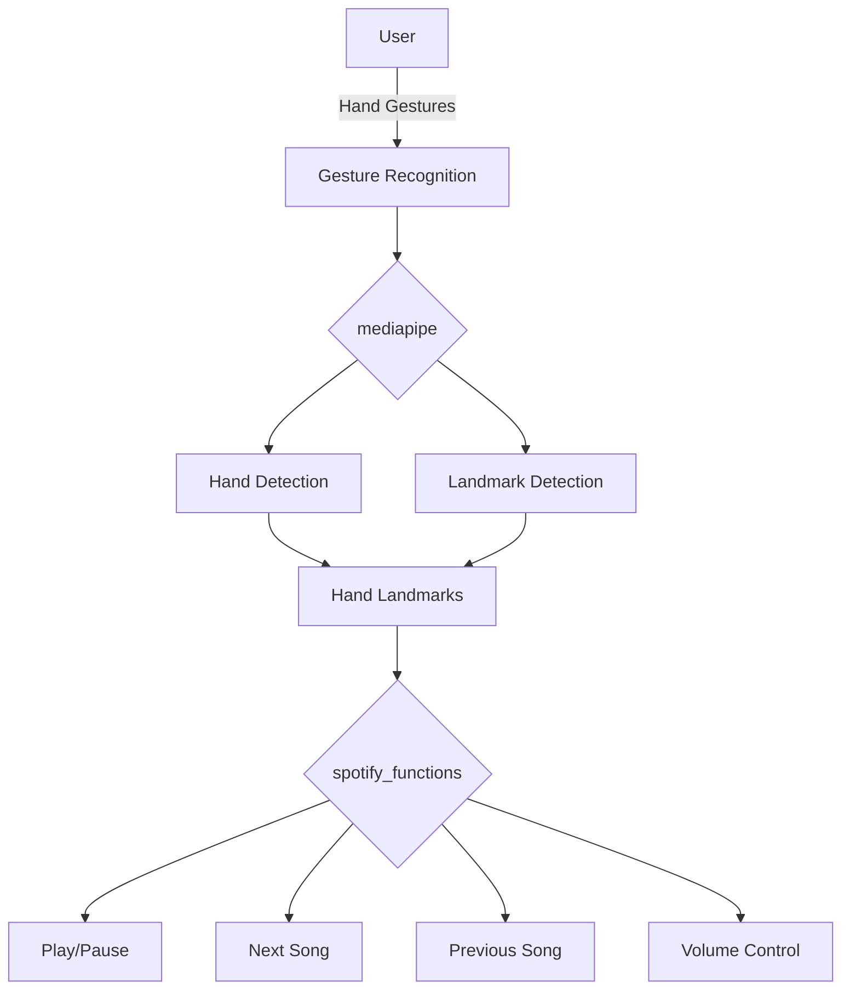

## Module: gesture_recognition.py
- **Module Name**: The module name is `gesture_recognition.py`.

- **Primary Objectives**: The main purpose of this module is to use hand gestures to control Spotify. It uses a webcam to capture video input, identifies hand gestures using MediaPipe, and then uses these gestures to control Spotify functions such as play/pause, volume control, and song navigation.

- **Critical Functions**: 
    - `start_capture()`: This function starts the webcam capture, processes the images, identifies hand gestures, and controls Spotify accordingly.
    - `sf.adjust_volume(vol_percent)`: Adjusts the volume of Spotify.
    - `sf.play_pause()`: Toggles play/pause on Spotify.
    - `sf.next_song()` and `sf.prev_song()`: Navigates to the next or previous song on Spotify.

- **Key Variables**: 
    - `mediaCap`: Captures video input from the webcam.
    - `max_distance`: Used for volume control.
    - `play_pause_active`, `next_prev_active`: Used to avoid repeated play/pause and song navigation actions.
    - `finger_up`: Dictionary used to detect if a finger is up or down.
    - `thumb_index_distance`: Calculates the distance between the thumb and index finger tips.
    - `volume_control_enabled`, `play_pause_gesture`, `next_song_gesture`, `previous_song_gesture`: Variables used to identify specific gestures.

- **Interdependencies**: This module interacts with the `mediapipe` library for hand gesture recognition and a `spotify_functions` module for Spotify control.

- **Core vs. Auxiliary Operations**: 
    - Core operations include capturing video input, processing the images, identifying hand gestures, and controlling Spotify.
    - Auxiliary operations include drawing hand landmarks and managing the UI (e.g., displaying volume level, showing play/pause status, etc.).

- **Operational Sequence**: The module starts by initializing the webcam capture. It then enters a loop where it reads frames from the webcam, processes the images to identify hand gestures, and uses these gestures to control Spotify. The loop continues until the 'q' key is pressed.

- **Performance Aspects**: The module's performance is largely dependent on the accuracy of the `mediapipe` hand gesture recognition and the responsiveness of the `spotify_functions` module. It also requires a webcam with good resolution and frame rate for accurate gesture recognition.

- **Reusability**: The module is specific to Spotify control, but the hand gesture recognition part can be reused for other applications. The Spotify control functions could also be replaced with other functions to control different applications.
## Mermaid Diagram

