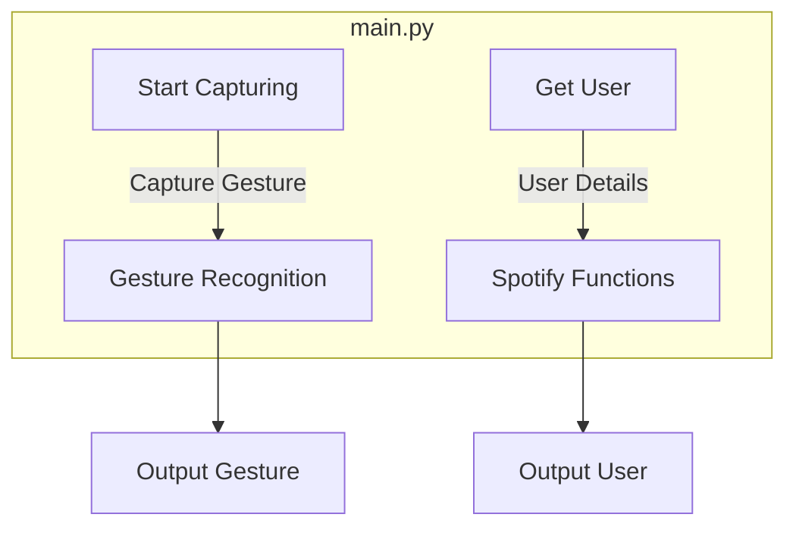

## Module: main.py
- **Module Name**: The module is `main.py`.

- **Primary Objectives**: The primary purpose of this module is to initiate gesture control for a Spotify user. It uses gesture recognition to control the Spotify account of the user. 

- **Critical Functions**: 
  - `sf.get_user()`: This function is used to get the username and trigger account authentication.
  - `gr.start_capture()`: This function starts the gesture capturing process.

- **Key Variables**: 
  - `username`: This variable stores the username returned by the `sf.get_user()` function.

- **Interdependencies**: This module depends on two other modules: `gesture_recognition` and `spotify_functions`. It uses functions from these modules to authenticate the user and start gesture recognition.

- **Core vs. Auxiliary Operations**: 
  - Core Operations: The core operations of this module are user authentication (`sf.get_user()`) and starting the gesture capturing process (`gr.start_capture()`).
  - Auxiliary Operations: Printing the username and the statement "Starting gesture control for user: " is an auxiliary operation.

- **Operational Sequence**: The module first imports the required packages. It then uses the `get_user()` function from the `spotify_functions` module to authenticate the user and store the username. After that, it prints a statement indicating the start of the gesture control for the user. Finally, it starts the gesture capturing process using the `start_capture()` function from the `gesture_recognition` module.

- **Performance Aspects**: The performance of this module primarily depends on the efficiency of the `gesture_recognition` and `spotify_functions` modules. The speed and accuracy of the gesture recognition process and the Spotify user authentication process can affect the overall performance.

- **Reusability**: This module is quite reusable. The method of obtaining the user and starting the gesture capture can be applied to any user and any application that requires gesture recognition, not just Spotify. However, the specific functions `sf.get_user()` and `gr.start_capture()` might need to be replaced or modified based on the requirements of the new use case.
## Mermaid Diagram

