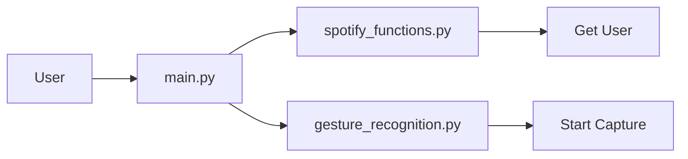

## Module: main.py
- **Module Name**: The module name is "main.py".

- **Primary Objectives**: The primary objective of this module is to integrate gesture recognition and Spotify functionality to control a Spotify account based on the user's gestures. It authenticates the user, initiates gesture capturing, and applies the recognized gestures to control the user's Spotify account.

- **Critical Functions**: 
  - `sf.get_user()`: This function is used to get the Spotify user's credentials for authentication.
  - `gr.start_capture()`: This function is used to start capturing the user's gestures.

- **Key Variables**: 
  - `username`: This variable is used to store the Spotify user's credentials.

- **Interdependencies**: This module relies on `gesture_recognition` and `spotify_functions` modules for its operations. It uses the `get_user` function from `spotify_functions` for user authentication and `start_capture` function from `gesture_recognition` to start capturing gestures.

- **Core vs. Auxiliary Operations**: The core operations of this module are user authentication and gesture capture. Printing the username is an auxiliary operation that provides user feedback but is not necessary for the main functionality.

- **Operational Sequence**: First, the module imports the necessary external modules. It then retrieves the Spotify user credentials, prints the username, and finally starts the gesture capturing process.

- **Performance Aspects**: The performance of this module depends on the efficiency of the `gesture_recognition` and `spotify_functions` modules. The speed and accuracy of gesture recognition and the responsiveness of the Spotify API will directly impact the performance.

- **Reusability**: The module's design is quite specific to its task, but the pattern of integrating two external modules (one for input capture and one for controlling an external service) could be reused in other contexts. The `username` retrieval and printing could also be reused for any application requiring Spotify user authentication.
## Mermaid Diagram

