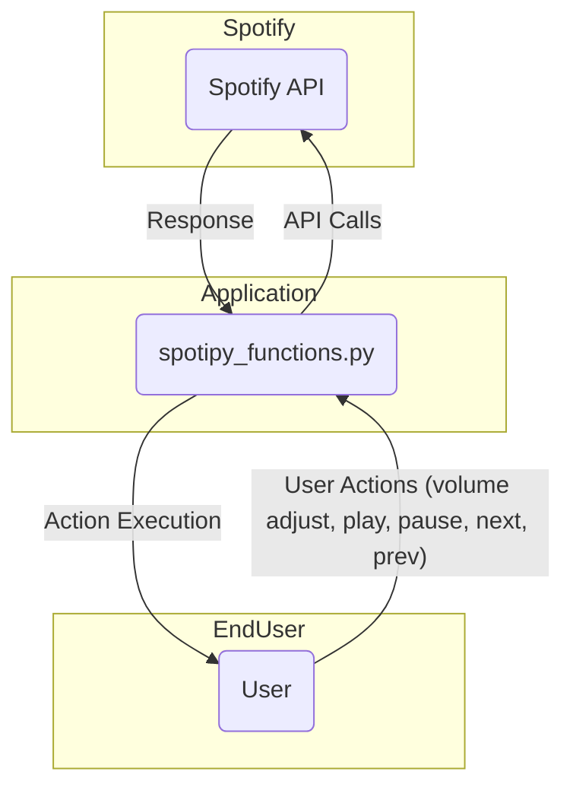

## Module: spotify_functions.py
- **Module Name**: spotify_functions.py

- **Primary Objectives**: This module's purpose is to manage Spotify user interactions through the Spotify API. It includes functions for getting user information, adjusting volume, controlling playback (play, pause, next song, previous song), and more.

- **Critical Functions**:
    - `get_user()`: Retrieves the Spotify username of the connected user.
    - `adjust_volume(vol_percent)`: Adjusts the volume to a given percentage value between 0-100.
    - `play_pause()`: Checks the user's playback status and either plays or pauses the music based on the current status.
    - `next_song()`: Skips to the next song in the queue.
    - `prev_song()`: Goes back to the previous song.

- **Key Variables**:
    - `SPOTIPY_CLIENT_ID`: The client ID for the Spotify API.
    - `SPOTIPY_CLIENT_SECRET`: The client secret for the Spotify API.
    - `SPOTIPY_REDIRECT_URI`: The redirect URI for the Spotify API.
    - `scope`: The scope defines the level of access that the app has to the user's Spotify data.

- **Interdependencies**: This module relies on the `spotipy` library, which is a lightweight Python library for the Spotify Web API.

- **Core vs. Auxiliary Operations**: Core operations include getting user information, controlling playback, and adjusting the volume. The creation of the Spotipy object and defining the scope are auxiliary operations that support the core functionality.

- **Operational Sequence**: First, the Spotipy object is created with the required credentials and scope. Then, the module provides various functions to control the user's Spotify experience, such as adjusting the volume or controlling playback.

- **Performance Aspects**: The performance of this module largely depends on the response time of the Spotify API. Efficient use of API calls and handling responses can improve the performance.

- **Reusability**: This module is highly reusable. The functions defined in this module can be reused in any application that requires control over Spotify's music playback. However, the client ID, client secret, and redirect URI must be replaced with the actual values for the application using this module.
## Mermaid Diagram

