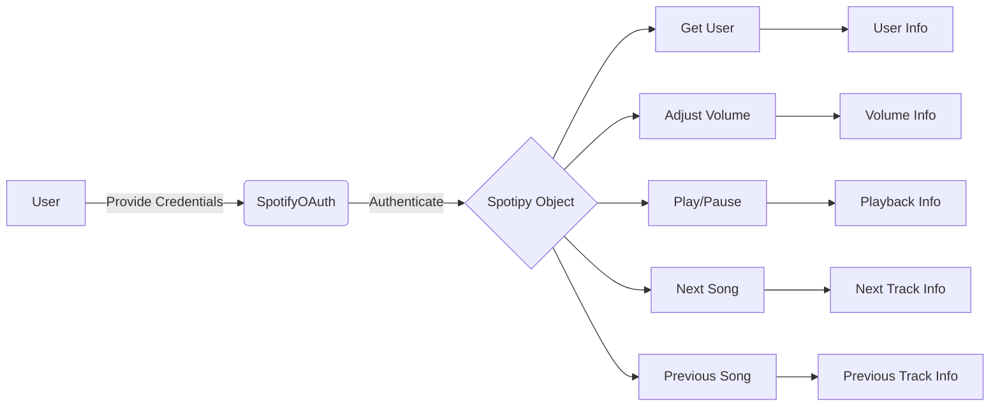

## Module: spotify_functions.py
- **Module Name**: spotify_functions.py

- **Primary Objectives**: This module is designed to interact with Spotify's API using the Spotipy library. Its main purpose is to control music playback, adjust volume, and fetch user information.

- **Critical Functions**:
  - `get_user()`: Fetches the Spotify username of the connected user.
  - `adjust_volume(vol_percent)`: Adjusts the playback volume to a given percentage (0-100%).
  - `play_pause()`: Checks the user's playback status and toggles between play and pause states.
  - `next_song()`: Skips to the next song in the queue.
  - `prev_song()`: Goes back to the previous song.

- **Key Variables**:
  - `SPOTIPY_CLIENT_ID`, `SPOTIPY_CLIENT_SECRET`, `SPOTIPY_REDIRECT_URI`: These are the credentials used for OAuth authentication with the Spotify API.
  - `scope`: Defines the permissions the app is requesting from the user.
  - `sp`: An instance of the Spotipy class, used to interact with the Spotify API.

- **Interdependencies**: This module interacts with the Spotify API and requires the Spotipy library. 

- **Core vs. Auxiliary Operations**: 
  - Core Operations: `get_user()`, `adjust_volume(vol_percent)`, `play_pause()`, `next_song()`, `prev_song()`.
  - Auxiliary Operations: Authentication and creation of the Spotipy object.

- **Operational Sequence**: After the Spotipy object is created with the necessary permissions, the functions can be called in any order based on user input or app requirements.

- **Performance Aspects**: Performance would largely depend on the response time of the Spotify API. Also, the `play_pause()` function could be optimized by directly passing the 'is_playing' status as a parameter instead of fetching it every time.

- **Reusability**: This module is highly reusable for any application that requires control over Spotify's playback. The functions are general and not tied to specific use cases. However, the Spotify credentials (`SPOTIPY_CLIENT_ID`, `SPOTIPY_CLIENT_SECRET`) would need to be replaced for each different application.
## Mermaid Diagram

